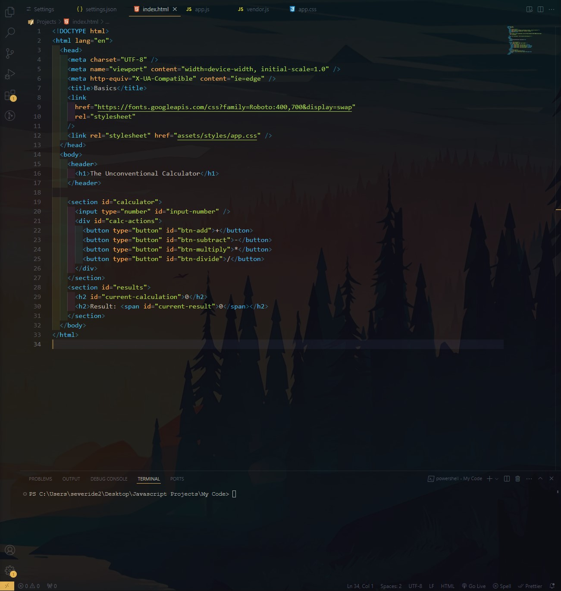

# My VSCode Settings

Find my settings for VSCode below (some settings inspired by <a href="https://youtube.com/#AsmrProg" target="_blank">AsmrProg</a>)

## How it looks

# Font and Cursor

Search for **"Font"** in VSCode settings and change the following:
- Font Family: `'cascadia code'` (<a href="https://github.com/microsoft/cascadia-code" target="_blank">Download from Microsoft</a>)
- Font Fize: `16`

Search for **"Cursor"** in VSCode settings and change the following:
- Cursor Style: `Line`
- Cursor Blinking: `Phase`
- Cursor Width: `3`
- Cursor Smooth Caret Animation: `on`

# Extensions

### Formatting Help
Check my `settings.json` for compatibility using multiple formatters.
- <a href="https://github.com/prettier/prettier-vscode" target="_blank">Prettier - Code formatter</a>  Formats code by enforcing a consistent style by parsing your code and re-printing it with its own rules.

- <a href="https://github.com/mike7515/code-beautifier" target="_blank">Beautify</a>  Formats CSS code nicely after saving (Ctrl + S).

- <a href="https://github.com/formulahendry/vscode-auto-rename-tag" target="_blank">Auto Rename Tag</a>  Automatically renames paired HTML/XML tag

- <a href="https://github.com/solnurkarim/HTML-to-CSS-autocompletion" target="_blank">HTML To CSS Autocompletion</a>  Provides completion suggestions for classes and ids from markup documents to stylesheets.

- <a href="https://github.com/Cardinal90/multi-cursor-case-preserve" target="_blank">Multiple cursor case preserve</a>  Preserves case of selection when editing multiple cursors.

### Visual Styling

- <a href="https://github.com/oderwat/vscode-indent-rainbow" target="_blank">indent-rainbow</a>  Makes indentation easier to read (pairs nicely with `"editor.guides.bracketPairs": "active",` in ).

- <a href="https://github.com/enyancc/vscode-ext-color-highlight" target="_blank">Color Highlight</a>  Styles CSS/Web colors found in your document.

- <a href="https://github.com/streetsidesoftware/vscode-spell-checker" target="_blank">Code Spell Checker</a>  Spell checker to help catch common spelling errors in code

### Debugging and Troubleshooting

- <a href="https://github.com/MicrosoftDocs/intellicode" target="_blank">Intellicode</a>  Allows you to see real-world examples of how other developers have used a given function via Github.

- <a href="https://github.com/usernamehw/vscode-error-lens" target="_blank">Error Lens</a>  Improve highlighting of errors, warnings and other language diagnostics.

- <a href="https://github.com/kufii/CodeSnap" target="_blank">Codesnap</a>  Quickly take screenshots of snippets of code.

### Testing and Preview

- <a href="https://github.com/ritwickdey/vscode-live-server" target="_blank">Live Server</a>  Launch a development local Server with live reload feature for static & dynamic pages.

- <a href="https://github.com/microsoft/vscode-livepreview" target="_blank">Live Preview</a>  An extension that hosts a local server for you to preview your web projects on! (Updates preview without saving file).

## Appearance

### Transparency/Glassy look
- <a href="https://github.com/hikarin522/GlassIt-VSC" target="_blank">Glassit-VSC</a>  Able to set the alpha/transparency of the window.  <b>Increase</b> transparency with Ctrl+Alt+Z  <b>Decrease</b> transparency with Ctrl+Alt+C

### Icons
- <a href="https://github.com/vscode-icons/vscode-icons" target="_blank">VSCode Icons</a>  Icons for Visual Studio Code (files icons).

### Themes
- <a href="https://github.com/ayu-theme/vscode-ayu" target="_blank">Ayu Theme</a>
- <a href="https://github.com/akamud/vscode-theme-onedark" target="_blank">Atom One Dark Theme</a>
- <a href="https://github.com/guilhermerodz/omni-owl" target="_blank">Omini Owl Theme</a>
- <a href="https://github.com/ahmadawais/shades-of-purple-vscode" target="_blank">Shades of Purple Theme</a>
